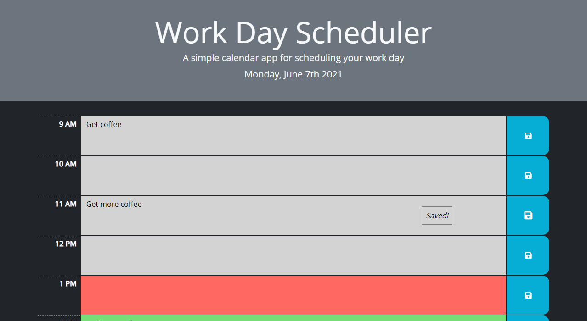
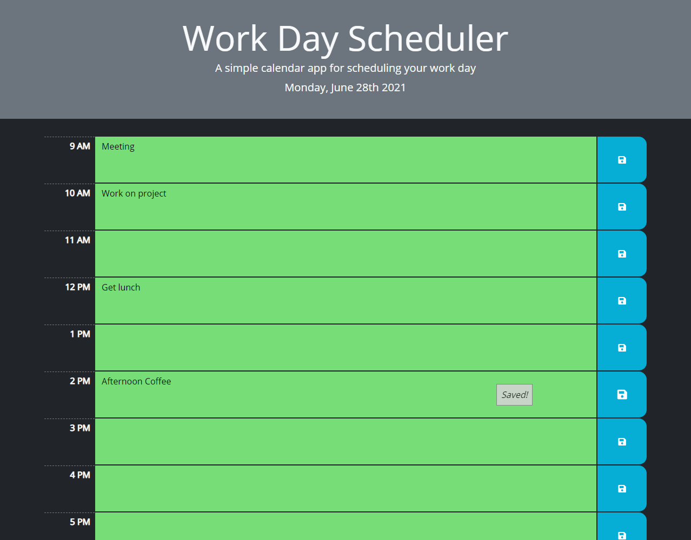

# Daily-Schedule

## Description
A planner you can use to schedule your work day. It shows the current day, and has a table of hours from 9 AM to 5 PM. The rows are color coded based on whether the hour has passed, is the current hour, or the hour is in the future.

## Technologies Used
Bootstrap, jQuery, Moment.js

### Usage
To enter an event, simply click on the box under the hour you want, and type in what you'll be doing. Then click the save button (to the right of the text box) to save the event to your local storage. You'll know that the event has been saved if the _"Saved!"_ tooltip appears.

## Background
I wanted some practice with Bootstrap and jQuery, both of which I learned to help accelerate my web development. Bootstrap is used on the HTML, and jQuery is used to grab elements in the JS.

## Link
[Click here to see the finished site.](https://jcpickens0215.github.io/Daily-Schedule/)

## Screenshots

## License
The MIT License (MIT)
Copyright © 2021 Justin Pickens

Permission is hereby granted, free of charge, to any person obtaining a copy of this software and associated documentation files (the “Software”), to deal in the Software without restriction, including without limitation the rights to use, copy, modify, merge, publish, distribute, sublicense, and/or sell copies of the Software, and to permit persons to whom the Software is furnished to do so, subject to the following conditions:

The above copyright notice and this permission notice shall be included in all copies or substantial portions of the Software.

THE SOFTWARE IS PROVIDED “AS IS”, WITHOUT WARRANTY OF ANY KIND, EXPRESS OR IMPLIED, INCLUDING BUT NOT LIMITED TO THE WARRANTIES OF MERCHANTABILITY, FITNESS FOR A PARTICULAR PURPOSE AND NONINFRINGEMENT. IN NO EVENT SHALL THE AUTHORS OR COPYRIGHT HOLDERS BE LIABLE FOR ANY CLAIM, DAMAGES OR OTHER LIABILITY, WHETHER IN AN ACTION OF CONTRACT, TORT OR OTHERWISE, ARISING FROM, OUT OF OR IN CONNECTION WITH THE SOFTWARE OR THE USE OR OTHER DEALINGS IN THE SOFTWARE.

## Contact
You can e-mail me at: justin.pickens.1994@gmail.com
